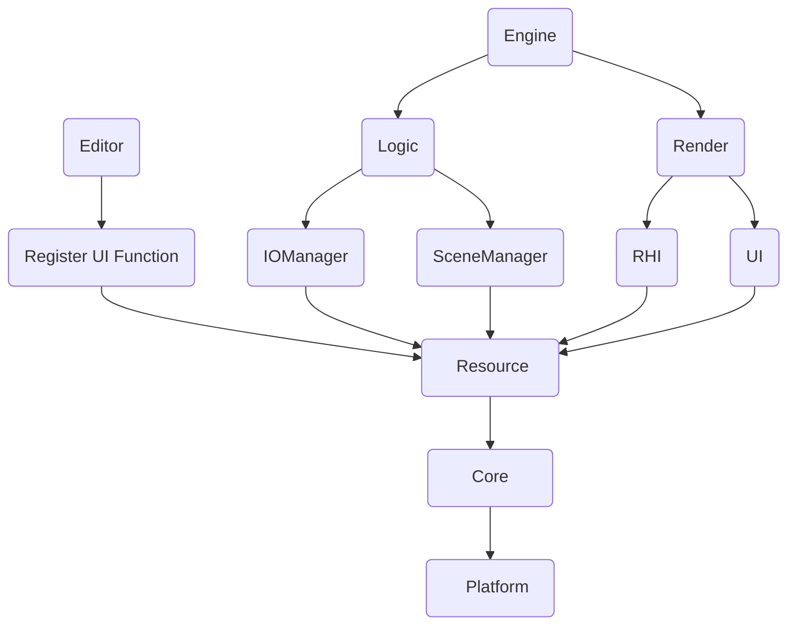

> LumiEngine on Github: https://github.com/LumiOwO/LumiEngine 

最近在学 [GAMES104](https://www.bilibili.com/video/BV1oU4y1R7Km)，准备参考课程提供的 [Pilot Engine](https://github.com/BoomingTech/Pilot) 架构，把自己引擎原来乱七八糟的代码重构一下。

## 1 Pilot 架构分析

GAMES104 中介绍的引擎结构主要分为以下 5 层：


- 工具层：系统UI、编辑器等用户工具
- 功能层：Logic Tick & Render Tick
    - 逻辑部分：物体变换、动画、物理等
    - 渲染部分：场景裁剪、绘制、后处理等
- 资源层：对资产的生命周期进行管理
- 核心层：数学库、内存分配、反射等
- 平台层：对不同平台进行适配，包括 RHI、硬件架构等等

其中引擎最核心的是程序主循环。以下为 GAMES104 课件中主循环的示意图。

<!--More-->


然而我阅读了 Pilot 的源码后，发现主循环的定义与上图稍有不同，如下所示。

```c++
while (true)
{
    logicalTick(delta_time);
    if (!rendererTick())
        return;
}
```

其中 `rendererTick` 中依次处理了三个模块：

- `m_io`：glfw 窗口的消息循环
- `m_rhi`：基于 Vulkan 的渲染模块
- `m_ui`：基于 imGUI 的系统 UI

## 2 总结之前的问题

我自己的引擎目前只实现了一个简单的 Vulkan demo，场景的加载基本上是 hardcode 的，也没有做任何的材质系统。因此这里总结一下存在的一些问题，希望后面的设计中能够避免。

- 没有做资源层，对模型等数据的加载比较混乱
- 场景提交给渲染模块时，应该做一个 culling
- 过量的冗余注释

综合以上考虑，我目前打算把自己的引擎组织成以下的形式：



## 3 待完成的模块

在代码重构之后，至少还需要添加以下模块，才能让我自己的引擎有相对完整的功能。

- 资源管理层
- 场景的层次结构
- 反射
- 系统 UI
- 处理窗口的 IO


> 参考内容
>
> 1. GAMES104, https://www.bilibili.com/video/BV1oU4y1R7Km
> 2. Pilot Engine, https://github.com/BoomingTech/Pilot
